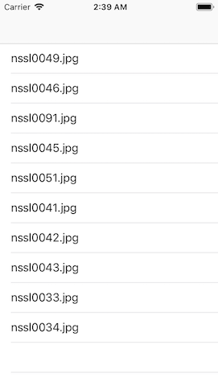
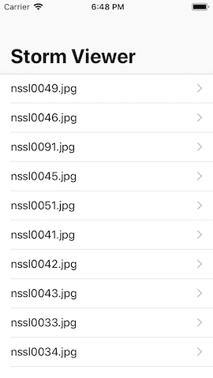

# Storm Viewer

## Description
You'll see an app that lets users scroll through a list of images, then select one to view.

## Programming To-Do List
- [x] **Listing Images with FileManager** : Get the images from the directory inside our app.
- [x] **Collect the NSSL images** : Look for the images with the prefix `nssl` and add them to an array property.
- [x] **Add UITableViewController** : Add the `UITableViewController` that will show the data.
- [x] **Add UITableViewCell** : Add the `UITableViewCell` to show the data on the pictures array.
- [x] **Design Detail Screen** : Add a `ViewController` to show the selected image.
- [x] **Load images with UIImage** : Load the images on the `DetailViewController`. 
- [x] **`hidesBarsOnTap` and safe area margins** : Add Large Titles to `ViewController` only, hide navigation bar when tap on `DetailViewController` and the bottom indicator of iPhone X.

## Demo
### features/listing-images-with-filemanager
| Screenshot 01 |
| ------------- |
|  |

### features/designing-interface
| Screenshot 02 |
| ------------- |
|  |

### features/load-images
| Screenshot 03 |
| ------------- |
|  |

### features/final-tweaks

| Screenshot 04 | Screenshot 05 | Screenshot 06 |
| ------------- | ------------- | ------------- |
|  |  |  |