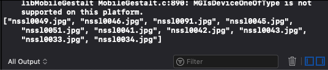

# Storm Viewer

## Description
You'll see an app that lets users scroll through a list of images, then select one to view.

## Programming To-Do List
- [x] **Listing Images with FileManager** : Get the images from the directory inside our app.
- [ ] **Collect the NSSL images** : Look for the images with the prefix `nssl` and add them to an array property.

## Demo
### features/listing-images-with-filemanager
| Screenshot 01 |
| ------------- |
|  |